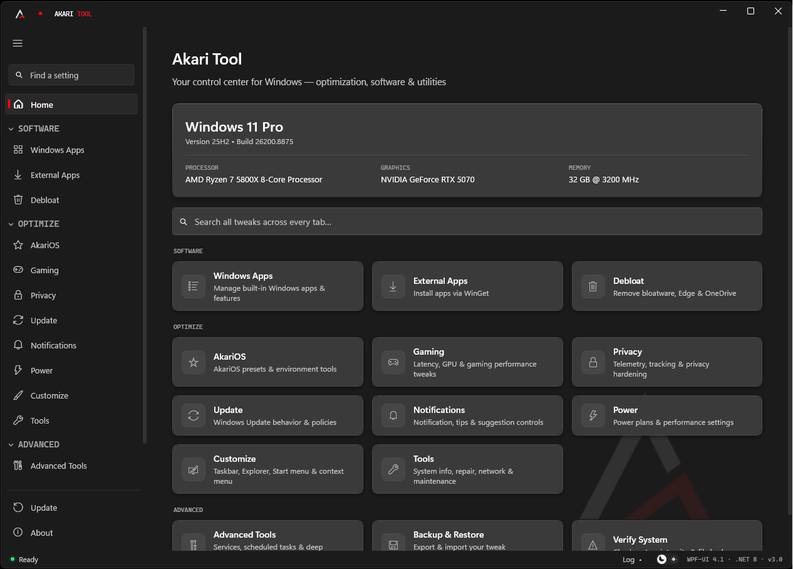

<div align="center">


# Akari Tool

**Gaming-ready in minutes, not hours.**

[](https://isleap9.github.io/Akari-Tool/)
[](https://github.com/isleap9/Akari-Tool)
[](https://github.com/isleap9/Akari-Tool)
[](https://dotnet.microsoft.com/en-us/download/dotnet/8.0)
[](LICENSE)

**[Website](https://isleap9.github.io/Akari-Tool/)** · **[Download](https://github.com/isleap9/Akari-Tool/releases/latest)** · **[Docs](https://isleap9.github.io/Akari-Tool/docs.html)** · **[Discord](https://discord.gg/UjjmYM6ytj)**



</div>

---

## What is Akari Tool?

Akari Tool is a WPF-based Windows optimization and customization utility built around one problem: **the hours between a fresh Windows install and a machine that's actually ready to game**. Debloat, services, latency tweaks, privacy, app installs, and visual setup — in one pass, from one window.

Built for Windows 11, stock or otherwise — no custom image required.

### Related projects

| | |
|---|---|
| **[Website](https://isleap9.github.io/Akari-Tool/)** | Features, install guide, troubleshooting and changelog. |
| **[PostInstall](https://github.com/isleap9/PostInstall)** | Driver and tool payload used by Akari Tool's GPU, network and launcher features. |
| **[Autounattend Generator](https://github.com/isleap9/Akari-Tool-Autounattend)** | Standalone builder for unattended Windows Setup XML. |
| **[Discord](https://discord.gg/UjjmYM6ytj)** | Community and support for Akari Tool. |

---

## Highlights

**Nothing is applied blindly.** Every tweak shows what Windows' own default is, whether Akari recommends changing it, and whether the change survives a reboot. Sections have one-click bulk actions with a live counter of how many settings differ from recommended.

**Windows fights back, and Akari notices.** Windows Update silently reverts registry tweaks. Akari Tool records what it wrote and tells you when something no longer matches — with a **Review** banner that shows what drifted and whether it went back to the Windows default or to some third value.

**Reversible by default.** Restore points before risky operations, internal backups for the things System Restore doesn't cover (BCD, power schemes), and a full export/import of every tweak state.

---

## Features

### 🏠 Home
Global search across every tweak in the app — type what you want, jump straight to it. Plus a system summary and quick jumps to every section.

### 🎮 Gaming
Direct registry and driver-level tweaks targeting gaming latency:

- **NVIDIA tweaks** — disable GPU preemption, HDCP, ECC, P-State lock, telemetry
- **FSO & Game Bar** — disable Fullscreen Optimizations and Xbox Game Bar
- **System Profile** — raise GPU/CPU scheduler priority for games
- **Network optimization** — TCP/IP stack tuning, plus a **DNS selector with DNS-over-HTTPS** (Cloudflare, Google, Quad9 — encrypted or plain)
- **SvcHost split threshold** — match to your RAM size for optimal process isolation
- **Win32PrioritySeparation** — control foreground/background CPU time allocation

### ⊞ AkariOS
Service presets and environment tools, all working on stock Windows 11:

- **Service presets** — apply the AkariOS service configuration (166 services optimized) as **Gaming** or **Daily**, or restore stock Windows startup. Daily keeps the optimizations but leaves Windows Update and ISO mounting working. Defender is never touched. Services that break things when disabled are set to Manual rather than Disabled.
- **System tweaks** — 30 registry tweaks, 15 ETW autologger disables, 12 IFEO process priorities, 66 scheduled task disables, filesystem tweaks and telemetry opt-outs, applied in one pass behind an automatic restore point
- **BCD tweaks** — legacy boot menu, dynamic tick, recovery mode, hibernation. Not covered by System Restore, so current values are backed up internally for undo.
- **Competitive Mode** *(experimental)* — see below
- **Shader Cache Cleaner** — see below
- Alt-Tab style, NVIDIA/AMD panels, account and system tweaks, and launchers for the PostInstall toolset

### 🏁 Competitive Mode *(experimental)*
Applies a set of temporary, session-scoped tweaks around a single game launch — then undoes all of them when the game exits.

- **Game process** — priority (Above Normal / High), I/O priority, CPU set hint
- **Game Focus** — suspends browsers, chat and media apps for the session, then resumes them. Nothing is closed, and game launchers, storefront clients and anti-cheat are never touched.
- **Pause non-essential services** — Windows Search and SysMain, restored to their exact prior state afterwards
- **Consistent Performance** — Ultimate/High Performance power plan plus CPU power-throttling opt-out for the game
- **Launch through Steam** — resolves the game's Steam AppID and starts it through the Steam client, avoiding the authentication failures that happen when a Steam game's `.exe` is launched directly
- **Desktop shortcuts** — start a Competitive session for one game without opening Akari Tool

Every change is written to disk *before* it's applied. If Akari Tool is closed unexpectedly mid-session, it offers to restore your settings on the next launch. If the game never starts, everything is restored automatically and nothing is left changed.

Priority and I/O changes use standard Windows APIs only — game memory is never touched. Some anti-cheats block them anyway; Akari Tool reports that and carries on rather than failing the session.

### 🧹 Shader Cache Cleaner
Clear DirectX, NVIDIA, AMD, Intel and Steam per-game shader caches, with each target's size shown before you commit.

Steam caches are found across every library in `libraryfolders.vdf`, including libraries on other drives. Cache *contents* are cleared rather than the directories themselves, so drivers keep caching normally. Files locked by a running game are skipped and reported instead of aborting the run.

### ⚡ Power
- **Persistent power plan** — Akari Tool clones your active scheme into a dedicated **"Akari Performance"** plan, so tweaks survive reboots and Windows updates instead of silently reverting. One-click revert to Balanced.
- **Core parking / CPU idle / throttle states** — eliminate wake latency and C-state DPC spikes
- **Timer resolution** — 0.5 ms scheduler tick via `NtSetTimerResolution`
- **PCIe ASPM & USB selective suspend** — keep the bus and your input devices awake
- **Hibernate** — disable to reclaim hiberfil.sys disk space

### 🔒 Privacy
Telemetry, tracking, and data collection controls — including Windows AI/Copilot, Edge AI, and Office AI switches, plus a UAC level selector (with honest warnings on the dangerous settings, because "recommended: never notify" is how other tools get people hurt).

### 🔄 Update & 🔔 Notifications
Windows Update behaviour and deferral policies, and controls for notifications, tips, suggestions and the setup nags Windows shows after a major upgrade.

### 🎨 Customize

**Taskbar** — alignment, search bar, Task View, Widgets, Copilot, Chat, **End Task on right-click**, auto-hide, clock seconds, badges, thumbnails, Aero Peek, Snap Assist, button grouping, verbose boot messages.

**Explorer** — file extensions (including `.lnk`), hidden files, full path display, compact view, Quick Access, AutoPlay, folder auto-discovery, Home/Gallery sidebar entries, **legacy Photo Viewer and classic Notepad file associations**. Changes batch and apply with a single Explorer restart.

**Start Menu** — clean all default pins (with immediate layout cache flush), hide Recommended, more-pins layout, Bing search, account notifications.

**Appearance & Desktop** — dark mode, transparency, accent colors, square corners, wallpaper and desktop icon behavior.

**Context Menu** — Classic right-click layout, CMD/PowerShell as Admin, Take Ownership, File Hash, Kill Not Responding, Shut Down menu, Run with Priority, Reboot to BIOS, and more.

### 📦 Software
- **App Installer** — searchable, filterable card catalogue of 200+ apps across Browsers, Dev, Gaming, Utilities, Comms and more. Queue any combination and install via WinGet.
- **Bloatware Removal** — telemetry, background apps, OneDrive, Edge (with protocol-redirect repair so Windows doesn't nag you to reinstall), unwanted UWP apps.

### 🛠️ Tools & Advanced Tools
- **System info, repair and maintenance** — network reset, integrity checks and the usual diagnostics, without hunting through Control Panel
- **WIM wizard** — extract an ISO, inject drivers, repack with oscdimg
- **Autounattend generator** — build an unattended Windows Setup XML with a 21-tweak catalog baked in

### ✅ Verify
Check system integrity and file hashes, so you can confirm what's on disk is what should be on disk.

### 💾 Backup & Restore
Export every tweak state to a versioned JSON. Importing shows a **review dialog** first — see exactly what will change (current → imported), pick what to apply, skip the rest.

### 🔃 Self-Updater
Checks GitHub Releases and updates in place — silent installer, automatic relaunch.

---

## Appearance

Light and dark themes tuned to native Windows 11 surface values — matching greys, 8px card radius, proper surface layering and card elevation. Akari Tool follows your Windows theme on first launch; picking a theme in-app pins that choice permanently.

---

## Requirements

- Windows 11 (some tweaks are Windows 11-specific)
- [.NET 8 Desktop Runtime](https://dotnet.microsoft.com/en-us/download/dotnet/8.0) (x64)
- Administrator privileges (required for registry and driver-level tweaks)

> **Note:** the installer is currently unsigned, so SmartScreen may warn on first run — click *More info → Run anyway*. Code signing is on the roadmap.

---

## Installation

Grab the latest `AkariTool-Setup-*.exe` from [Releases](https://github.com/isleap9/Akari-Tool/releases/latest) and run it. Akari Tool keeps itself up to date from there.

Full install walkthrough and troubleshooting: **[isleap9.github.io/Akari-Tool/docs.html](https://isleap9.github.io/Akari-Tool/docs.html)**

---

## Building from Source

```bash
git clone https://github.com/isleap9/Akari-Tool.git
cd Akari-Tool
dotnet build AkariTool.csproj
```

To build a release binary:

```bash
dotnet publish AkariTool.csproj -c Release
```

Output: `bin\Release\net8.0-windows\win-x64\publish\`

To build the installer, run `build-installer.ps1` (requires [Inno Setup](https://jrsoftware.org/isinfo.php)).

---

## Website

The site in [`docs/`](docs) is published with GitHub Pages at **[isleap9.github.io/Akari-Tool](https://isleap9.github.io/Akari-Tool/)**. Plain HTML, no build step — the download button, star count and changelog read the GitHub API live, so releases never need to be copied in by hand.

---

## Notes

- **Timer Resolution** (0.5 ms) is session-lifetime — it resets when Akari Tool closes.
- **Competitive Mode** is experimental. It's designed to restore everything it changes, and a restart clears anything it could leave behind, but it hasn't been widely tested yet.
- All tweaks store their applied state in `HKCU\Software\AkariTool` so toggles restore correctly across restarts, and everything rendered in the app is automatically capturable by Backup & Restore.

---

## Credits

Registry tweak references from [CTT WinUtil](https://github.com/ChrisTitusTech/winutil) and [Winhance](https://github.com/memstechtips/winhance). Edge removal protocol redirect based on [OpenWebSearch](https://github.com/AveYo/fox) by AveYo.

---

<div align="center">
<sub>Made with ❤️ by the Akari Tool community</sub>
</div>
